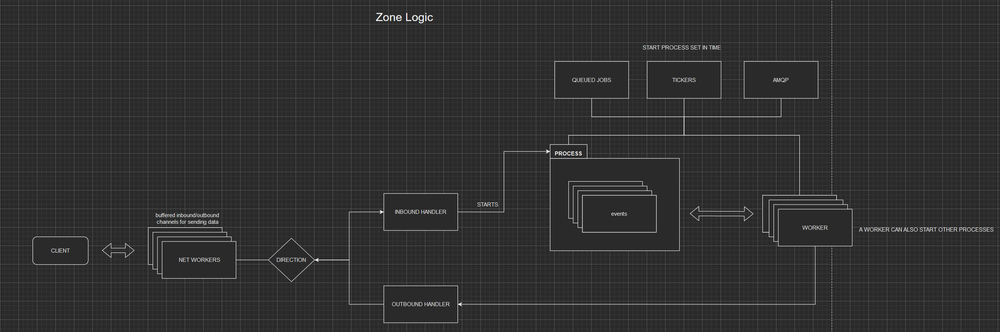

# Shine Engine Emulator

---

Videos showcase: 

- [tools - packet sniffer](https://www.youtube.com/watch?v=Y08oHJucHRI)
- [world - character creation](https://www.youtube.com/watch?v=GF7cUkPe6BI&t=16s)
- [zone  - player movements](https://www.youtube.com/watch?v=WPR9IcppmkI)
- [zone  - entity interaction range](https://www.youtube.com/watch?v=cSnldVbl2wA&feature=youtu.be)
- [zone  - entity interaction range 2](https://www.youtube.com/watch?v=roSZNHxg7o4)
- [zone  - monsters!!](https://www.youtube.com/watch?v=f7nPVcIaKfw)

## Event logic for login, world, zone services

#### From tcp connection to network command to logic handler

#### Processes and events example

    