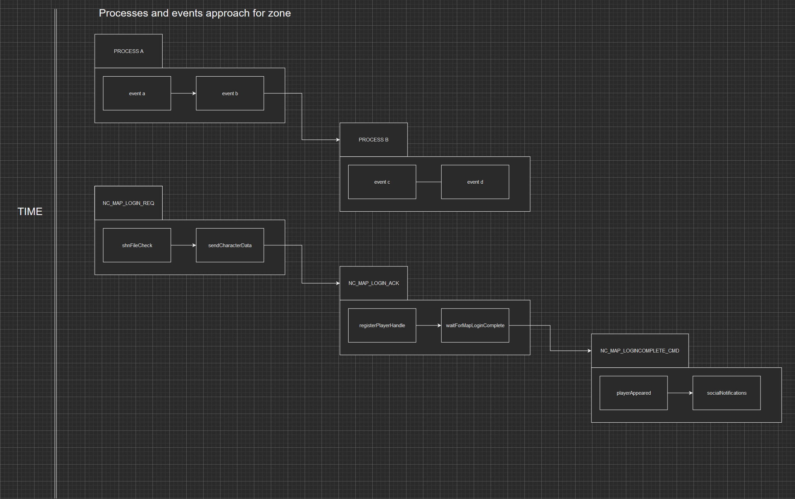

# Shine Engine Emulator

---

Videos showcase: 

- [tools - packet sniffer](https://www.youtube.com/watch?v=Y08oHJucHRI)
- [world - character creation](https://www.youtube.com/watch?v=GF7cUkPe6BI&t=16s)
- [zone  - player movements](https://www.youtube.com/watch?v=WPR9IcppmkI)
- [zone  - entity interaction range](https://www.youtube.com/watch?v=cSnldVbl2wA&feature=youtu.be)
- [zone  - entity interaction range 2](https://www.youtube.com/watch?v=roSZNHxg7o4)
- [zone  - monsters!!](https://www.youtube.com/watch?v=f7nPVcIaKfw)

## Docker setup
     # you may need access to some private repositories, contact me if so   
     git submodule update --init

     cp .env.dist .env
     
     docker-compose up -d --build

## Manual setup (easier for development of individual services)
     # you may need access to some private repositories, contact me if so
      git submodule update --init
    
     cp .env.dist .env
        
     # run only postgres + redis
     docker-compose -f docker-compose.local.yml up -d
     
     go mod download
    
    # run migrations on the database
     go run /app/cmd/migrations/main.go up
    
     # run services    
     go run /app/cmd/world-master/world-master.go serve --config "/app/configs/local/world-master.yml"
     go run /app/cmd/zone-master/zone-master.go serve --config "/app/configs/local/zone-master.yml"
     go run /app/cmd/world/world.go serve --config "/app/configs/local/world.yml"
     go run /app/cmd/login/login.go serve --config "/app/configs/local/login.yml"
     go run /app/cmd/zone/zone.go serve --config "/app/configs/local/zone.yml"

## Metrics
   
For metrics I use the following services:    
    - Prometheus
    - Loki
    - Grafana

The services are configured and ready to use in the **docker-compose.metrics.yml** file. You can get something like this:

    
## Event logic for login, world, zone services

#### From tcp connection to network command to logic handler

#### Processes and events example

    