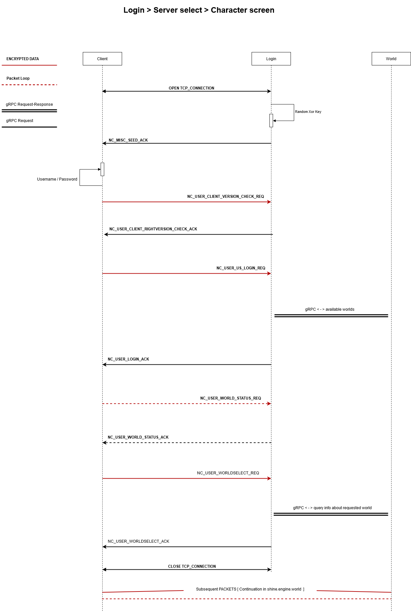

# Shine Engine Login Service

> Emulated login service.
---

If changes are needed on the core module, append to the file go.mod:
       
    replace github.com/shine-o/shine.engine.core => C:\Users\marbo\go\src\github.com\shine-o\shine.engine.core

# Overview

